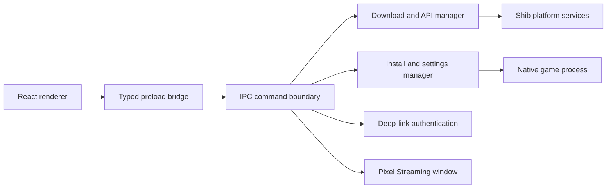

# Shib Portal Desktop

Shib Portal Desktop is a cross-platform game library and launch client for the Shib ecosystem. It brings authentication, catalog discovery, content delivery, installation, local settings, player profiles, native game launch, and Pixel Streaming access into one Electron application.

The codebase separates privileged desktop operations from the React interface through an explicit preload bridge. Downloads, file extraction, process launch, persistent configuration, and authenticated network requests stay in Electron's main process; the renderer consumes a typed, task-oriented API.

## Engineering highlights

- Deep-link authentication handoff from the browser portal into the desktop session
- Multi-chain Shib identity integration across Shibarium and Ethereum networks
- Game catalog, library, detail, profile, and settings experiences
- Resumable downloads with per-file progress, speed reporting, pause, resume, and cancellation
- Archive extraction, version tracking, update state, and configurable installation locations
- Native game-process launch with close detection and renderer notifications
- Persisted graphics, resolution, audio, token, profile, and library state
- Pixel Streaming window orchestration for cloud-delivered experiences
- Isolated renderer access through Electron `contextBridge` and centralized IPC bindings
- Windows installer, macOS package, and Linux AppImage, Snap, and Debian targets

## Process architecture



## Desktop responsibilities

| Area | Implementation |
| --- | --- |
| Authentication | Browser deep-link return, token persistence, Shib Auth SDK context |
| Discovery | Home, library, game detail, and player profile routes |
| Delivery | Chunked downloads, persisted progress, pause/resume/cancel, archive extraction |
| Installation | User-selected library path, installed-version registry, update state |
| Launch | Native child-process execution, argument handoff, close and failure events |
| Preferences | Graphics mode, resolution, quality, master/music/SFX levels |
| Streaming | Dedicated Pixel Streaming window open/close lifecycle |
| Packaging | Electron Vite build plus electron-builder targets for Windows, macOS, and Linux |

## Technology

- Electron 31, electron-vite, and electron-builder
- React 18, React Router, TypeScript, and Vite
- Shib Auth, Identity, Account Abstraction, and shared UI SDKs
- Electron Store for local state
- Axios, Node streams, and unzipper for content delivery
- Web3, wallet provider integrations, JWT handling, and React Query

## Repository map

| Path | Responsibility |
| --- | --- |
| `src/main/` | Window lifecycle, deep-link auth, downloads, filesystem operations, game launch, and IPC bindings |
| `src/preload/` | Narrow renderer-facing desktop API exposed through `contextBridge` |
| `src/renderer/src/pages/` | Boot, login, home, library, game detail, profile, and update screens |
| `src/renderer/src/components/` | Download, library, profile, settings, media, and authentication UI |
| `config/config.json` | Development and production service endpoints |
| `electron-builder.yml` | Platform packaging and installer configuration |
| `resources/` and `build/` | Application icons and packaging resources |

## Local development

### Prerequisites

- Node.js 20 or newer
- npm access to the private `@shibaone` packages referenced by the project
- Access to the configured Shib portal and backend environment

```bash
npm install
npm run dev
```

Validation and packaging commands:

```bash
npm run typecheck
npm run build
npm run build:win
npm run build:mac
npm run build:linux
```

Platform packaging should be performed on a compatible host with the signing and notarization material required by the target environment.

## Ecosystem context

The launcher is the desktop entry point for [Shib: The Metaverse](https://github.com/Elia-Youssef/ShibTheMetaverse). It relies on the private `ShibPortal-Frontend` service for browser-based identity handoff and the private `Shib-Backend` service for catalog and user data. Explore the production visuals in the [Rebel Art Studios case study](https://rebelartstudios.org/project/shib-the-metaverse).

## Ownership and licensing

This repository has no open-source license. Unless a separate agreement grants permission, its source and assets are provided for authorized development and portfolio reference only.
